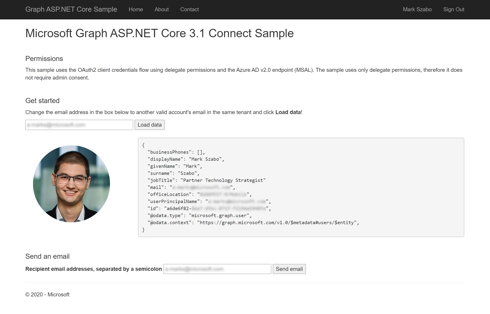

# Microsoft Graph Connect Sample for ASP.NET Core 2.1

**Scenario**: Use ASP.NET Core 2.1 MVC to connect to Microsoft Graph using the delegated permissions flow to retrieve a user's profile, their photo from Azure AD (v2.0) endpoint and then send an email that contains the photo as attachment.

The sample uses OpenID Connect for sign in, [Microsoft Authentication Library (MSAL) for .NET](https://github.com/AzureAD/microsoft-authentication-library-for-dotnet) to obtain an access token, and the [Microsoft Graph Client Library for .NET](https://github.com/microsoftgraph/msgraph-sdk-dotnet) (SDK) to interact with Microsoft Graph. The MSAL SDK provides features for working with the [Azure AD v2.0 endpoint](https://azure.microsoft.com/en-us/documentation/articles/active-directory-appmodel-v2-overview), which enables developers to write a single code flow that handles authentication for both work or school (Azure Active Directory) and personal (Microsoft) accounts.
The sample uses only delegate permissions, therefore it does not require admin consent.

>Previous version of this sample that uses ASP.NET Core 1.1 version is [here](https://github.com/microsoftgraph/aspnetcore-connect-sample/tree/netcore1.1) and the ASP.NET Core 2.0 version [here](https://github.com/microsoftgraph/aspnetcore-connect-sample/tree/netcore2.0).

## Table of contents

- [Register the app](#register-the-app)
- [Prerequisites](#prerequisites)
- [Configure and run the sample](#configure-and-run-the-sample)
- [Key components of the sample](#key-components-of-the-sample)
- [Contributing](#contributing)
- [Questions and comments](#questions-and-comments)
- [Additional resources](#additional-resources)

## Differences between ADAL and MSAL

ADAL (Azure AD v1.0) and MSAL (Azure AD v2.0) are both authentication libraries for a wide variety of languages, which enable you to acquire tokens from Azure AD, to access protected Web APIs (Microsoft APIs or applications registered with Azure Active Directory). ADAL applications allow users to sign-in with their work and school account and need to be registered in the [Azure portal](https://portal.azure.com/), while applications that use the new (in-preview) MSAL allow users to sign-in with either their work and school accounts or their personal accounts and need to be registered in the [application registration portal](https://apps.dev.microsoft.com/), unless they are Azure AD B2C applications. Both ADAL and MSAL do have their .NET client libraries: [ADAL.NET](https://github.com/AzureAD/azure-activedirectory-library-for-dotnet) and [MSAL.NET](https://github.com/AzureAD/microsoft-authentication-library-for-dotnet) respectively. [Learn more about the migration and differences between ADAL.NET and MSAL.NET here.](https://github.com/AzureAD/microsoft-authentication-library-for-dotnet/wiki/adal-to-msal)

## Prerequisites

To use the Microsoft Graph Connect Sample for ASP.NET Core 2.1, you need the following:

- Visual Studio 2017 [with .NET Core 2.1 SDK](https://www.microsoft.com/net/download/core) installed on your development computer.
- Either a [personal Microsoft account](https://signup.live.com) or a [work or school account](https://dev.office.com/devprogram). (You don't need to be an administrator of the tenant.)
- The application ID and key from the application that you [register on the App Registration Portal](#register-the-app).

## Register the app

1. Navigate to the [Azure AD Portal](https://portal.azure.com). Login using a **personal account** (aka: Microsoft Account) or **Work or School Account** with permissions to create app registrations.

    > **Note:** If you do not have permissions to create app registrations contact your Azure AD domain administrators.

2. Click **Azure Active Directory** from the left-hand navigation menu.

3. Click **App registrations** from the current blade navigation pane.

4. Click **New registration** from the current blade content.

5. On the **Register an application** page, specify the following values:

    - **Name** = [Desired app name]
    - **Supported account types** = \<choose the value that applies to your needs\>
    - **Redirect URI**
        - Type (dropdown) = Web
        - Value = `https://localhost:44334/signin-oidc`

    > **Note:** Ensure that the Redirect URI value is unique within your domain.  This value can be changed at a later time and does not need to point to a hosted URI.  If the example URI above is already used please choose a unique value.

    1. Under **Advanced settings**, set the value of the **Logout URL** to `https://localhost:44334/Account/SignOut`
    2. Copy the **Redirect URI** as you will need it later.

6. Once the app is created, copy the **Application (client) ID** and **Directory (tenant) ID** from the overview page and store it temporarily as you will need both later.

7. Click **Certificates & secrets** from the current blade navigation pane.

    1. Click **New client secret**.
    2. On the **Add a client secret** dialog, specify the following values:

        - **Description** = MyAppSecret1
        - **Expires** = In 1 year

    3. Click **Add**.

    4. After the screen has updated with the newly created client secret copy the **VALUE** of the client secret and store it temporarily as you will need it later.

        > **Important:** This secret string is never shown again, so make sure you copy it now.
        > In production apps you should always use certificates as your application secrets, but for this sample we will use a simple shared secret password.
8. Click **Authentication** from the current blade navigation pane.
    1. Select 'ID tokens'
9. Click **API permissions** from the current blade navigation pane.

    1. Click **Add a permission** from the current blade content.
    2. On the **Request API permissions** panel select **Microsoft Graph**.

    3. Select **Delegated permissions**.
    1. In the "Select permissions" search box type "User".
    2. Select **openid**, **email**, **profile**, **offline_access**, **User.Read**, **User.ReadBasic.All** and **Mail.Send**.

    3. Click **Add permissions** at the bottom of flyout.

    > **Note:** Microsoft recommends that you explicitly list all delegated permissions when registering your app. While the incremental and dynamic consent capabilities of the v2 endpoint make this step optional, failing to do so can negatively impact admin consent.

## Configure and run the sample

1. Download or clone the Microsoft Graph Connect Sample for ASP.NET Core.

2. Open the **MicrosoftGraphAspNetCoreConnectSample.sln** sample file in Visual Studio 2017.

3. In Solution Explorer, open the **appsettings.json** file in the root directory of the project.  

   a. For the **AppId** key, replace `ENTER_YOUR_APP_ID` with the application ID of your registered application.  

   b. For the **AppSecret** key, replace `ENTER_YOUR_SECRET` with the password of your registered application. Note that in production apps you should always use certificates as your application secrets, but for this sample we will use a simple shared secret password.  

4. Press F5 to build and run the sample. This will restore NuGet package dependencies and open the app.

   >If you see any errors while installing packages, make sure the local path where you placed the solution is not too long/deep. Moving the solution closer to the root of your drive resolves this issue.

5. Sign in with your personal (MSA) account or your work or school account and grant the requested permissions.

6. You should see your profile picture and your profile data in JSON on the start page.

7. Change the email address in the box to another valid account's email in the same tenant and choose the **Load data** button. When the operation completes, the profile of the choosen user is displayed on the page.

8. Optionally edit the recipient list, and then choose the **Send email** button. When the mail is sent, a Success message is displayed on the top of the page.

## Key components of the sample

The following files contain code that's related to connecting to Microsoft Graph, loading user data and sending emails.

- [`appsettings.json`](MicrosoftGraphAspNetCoreConnectSample/appsettings.json) Contains values used for authentication and authorization.
- [`Startup.cs`](MicrosoftGraphAspNetCoreConnectSample/Startup.cs) Configures the app and the services it uses, including authentication.

### Controllers

- [`AccountController.cs`](MicrosoftGraphAspNetCoreConnectSample/Controllers/AccountController.cs) Handles sign in and sign out.
- [`HomeController.cs`](MicrosoftGraphAspNetCoreConnectSample/Controllers/HomeController.cs) Handles the requests from the UI.

### Views

- [`Index.cshtml`](MicrosoftGraphAspNetCoreConnectSample/Views/Home/Index.cshtml) Contains the sample's UI.

### Helpers

- [`GraphAuthProvider.cs`](MicrosoftGraphAspNetCoreConnectSample/Helpers/GraphAuthProvider.cs) Gets an access token using MSAL's **AcquireTokenSilentAsync** method.
- [`GraphSdkHelper.cs`](MicrosoftGraphAspNetCoreConnectSample/Helpers/GraphSDKHelper.cs) Initiates the SDK client used to interact with Microsoft Graph.
- [`GraphService.cs`](MicrosoftGraphAspNetCoreConnectSample/Helpers/GraphService.cs) Contains methods that use the **GraphServiceClient** to build and send calls to the Microsoft Graph service and to process the response.
  - The **GetUserJson** action gets the user's profile by an email address and converts it to JSON.
  - The **GetPictureBase64** action gets the user's profile picture and converts it to a base64 string.
  - The **SendEmail** action sends an email on behalf of the current user.

## Important note about the MSAL Preview

This library is suitable for use in a production environment. We provide the same production level support for this library as we do our current production libraries. During the preview we may make changes to the API, internal cache format, and other mechanisms of this library, which you will be required to take along with bug fixes or feature improvements. This may impact your application. For instance, a change to the cache format may impact your users, such as requiring them to sign in again. An API change may require you to update your code. When we provide the General Availability release we will require you to update to the General Availability version within six months, as applications written using a preview version of library may no longer work.

## Contributing

If you'd like to contribute to this sample, see [CONTRIBUTING.MD](/CONTRIBUTING.md).

This project has adopted the [Microsoft Open Source Code of Conduct](https://opensource.microsoft.com/codeofconduct/). For more information see the [Code of Conduct FAQ](https://opensource.microsoft.com/codeofconduct/faq/) or contact [opencode@microsoft.com](mailto:opencode@microsoft.com) with any additional questions or comments.

## Questions and comments

We'd love to get your feedback about the Microsoft Graph Connect Sample for ASP.NET Core. You can send your questions and suggestions to us in the [Issues](https://github.com/microsoftgraph/aspnetcore-connect-sample/issues) section of this repository.

Questions about Microsoft Graph in general should be posted to [Stack Overflow](https://stackoverflow.com/questions/tagged/MicrosoftGraph). Make sure that your questions or comments are tagged with *[MicrosoftGraph]*.

You can suggest changes for Microsoft Graph on [UserVoice](https://officespdev.uservoice.com/).

## Additional resources

- [Microsoft Graph documentation](https://developer.microsoft.com/graph)
- [Other Microsoft Graph Connect samples](https://github.com/MicrosoftGraph?q=connect)
- [Microsoft Graph Webhooks Sample for ASP.NET Core](https://github.com/microsoftgraph/aspnetcore-apponlytoken-webhooks-sample)
- [Microsoft Graph Connect Sample for ASP.NET 4.6](https://github.com/microsoftgraph/aspnet-connect-sample)

## Copyright

Copyright (c) 2018 Microsoft. All rights reserved.
